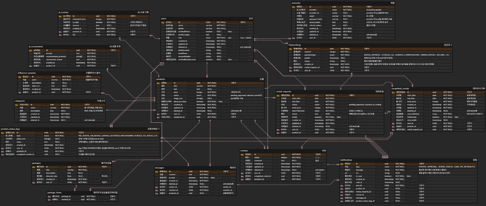

# FitPull Overflow (FOF)

## 프로젝트 소개

FitPull Overflow는 "모든 것을 대여한다"는 컨셉의 대여 서비스 플랫폼입니다. 물건, 장소, 재능 등 다양한 항목을 대여할 수 있는 서비스를 제공합니다.

## ERD

[ERD 원본 보기 (ERDCloud)](https://www.erdcloud.com/d/waj7NZ2NAPBamqBPM)

## 핵심 기능

### 1. 상품 등록 및 관리

-   사용자 상품 등록 (사진, 소개글)
-   관리자 검수 시스템
-   AI 기반 가격 적정성 검사
-   상품 상태 인증 시스템

### 2. AI 기반 서비스

-   상품 가격 적정성 검사
-   중고나라, 당근, 쿠팡, 네이버쇼핑 등 시세 크롤링
-   상황별 맞춤 상품 추천
-   패키지 상품 추천

### 3. 대여 시스템

-   예약 시스템
-   기간별 가격 할인
-   패키지 대여 기능
-   장기 대여 시 구매 옵션

### 4. 보안 및 인증

-   전화번호 인증
-   본인명의 계좌 검증
-   신분증 인증 (선택)
-   상품 상태 로그 관리

## 기술 스택

-   Backend: Node.js, Express.js
-   Database: PostgreSQL (AWS RDS)
-   ORM: Prisma
-   Container: Docker
-   AI: (검토 중)
-   실시간 통신: Socket.io (상품 문의용)

## 주요 카테고리

-   전자제품
-   의류
-   장소
-   시계
-   가방
-   책/도서류
-   사람 (재능)

## 비즈니스 모델

-   대여 수수료: 대여가격의 일정 %
-   판매 수수료: 별도 책정
-   보관료: 장기 미대여 상품

## 향후 계획

-   인플루언서 홍보관
-   실시간 채팅 시스템
-   전문가 시스템 (변호사, 제품평가사 등)

## 시작하기

### 필수 조건

-   Node.js
-   Docker
-   PostgreSQL (AWS RDS)
