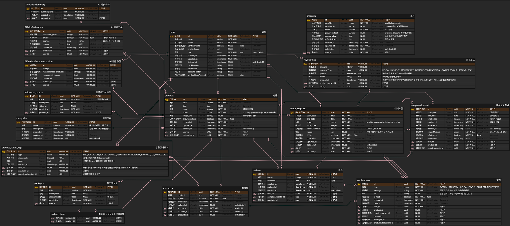

# FitPull Overflow (FOF)

## 프로젝트 소개

FitPull Overflow는 "자신에게 꼭 맞는 모든 것을 대여한다"는 컨셉의 대여 서비스 플랫폼입니다.  
물건, 장소, 사람, 재능까지 — 당신이 가진 어떤 것이든 필요한 누군가에게 빌려줄 수 있어요.

-   `git pull`처럼 필요한 걸 당겨온다는 느낌 + 라임 맞추어서 `fit pull`
-   `Stack Overflow`처럼 차고 넘치는 느낌을 주고 싶어서 `overflow`

---

### 기획 배경

이 프로젝트는 저와 같은 **극도의 I성향 + 귀차니즘**을 가진 유저들을 위해 만들었습니다.

-   직접 만나는 것은 부담스럽고 어려운데 방에 이제는 사용하지 않는 물건이 놀고있는건 불편하고...
-   수익은 내고 싶지만, 사진 찍기/배송/관리 같은 건 직접하려니 너무 귀찮고...
-   중고거래 특유의 애매한 톤앤매너도 어색하고... 새로운 사람 만나기는 너무 무섭고 피곤해요 ...

그래서 **유저는 상품만 보내면**, 그 이후의 모든 과정은 어드민/운영진이 처리합니다.

-   상품 검수/촬영
-   보관 및 상태 기록
-   대여/반납 처리
-   문의 대응까지

**"No 직거래, No 피곤함"**

## FOF입니다.

## ERD

[ERD 원본 보기 (ERDCloud)](https://www.erdcloud.com/d/waj7NZ2NAPBamqBPM)

## 핵심 기능

### 1. 상품 등록 및 관리

-   사용자 상품 등록 (사진, 소개글)
-   관리자 검수 시스템
-   AI 기반 가격 적정성 검사
-   상품 상태 인증 시스템

### 2. AI 기반 서비스

-   상품 가격 적정성 검사 상품명을 통해 중고나라, 당근마켓, 쿠팡에서 적절한 가격응답
-   상황별 맞춤 상품 추천
-   상품평 요약 기능

### 3. 대여 시스템

-   예약 시스템
-   기간별 가격 할인
-   패키지 대여 기능
-   장기 대여 시 구매 옵션

### 4. 보안 및 인증

-   전화번호 인증
-   상품 상태 로그 관리 

## 기술 스택

-   Backend: Node.js, Express.js
-   Database: PostgreSQL (AWS RDS)
-   ORM: Prisma
-   AI: openAI GPT
-   실시간 알람: Socket.io

## 주요 카테고리

-   전자제품
-   의류
-   장소
-   시계
-   가방
-   책/도서류
-   사람 (재능)

## 비즈니스 모델

-   대여 수수료: 대여가격의 일정 % 혹은 건당 가격
-   판매 수수료: 별도 책정 
-   보관료: 장기 미대여 상품 보관료 징수

## 향후 계획

-   인플루언서 홍보관
-   전문가 시스템 (변호사, 제품평가사 등)
-   패키지 상품 대여 등

### 필수 조건

-   Node.js
-   Docker
-   PostgreSQL (AWS RDS)

### 시작 하기 

-  프로젝트 클론
git clone https://github.com/P-FitPull/FitPull-BE.git
-  도커 컨테이너 빌드 및 실행
docker-compose up --build
