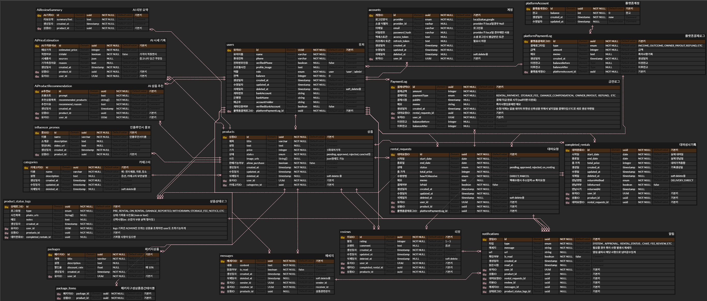

# FitPull Overflow (FOF)

## 프로젝트 소개

FitPull Overflow는 "자신에게 꼭 맞는 모든 것을 대여한다"는 컨셉의 대여 서비스 플랫폼입니다.  
물건, 장소, 사람, 재능까지 — 당신이 가진 어떤 것이든 필요한 누군가에게 빌려줄 수 있어요.

-   `git pull`처럼 필요한 걸 당겨온다는 느낌 + 라임 맞추어서 `fit pull`
-   `Stack Overflow`처럼 차고 넘치는 느낌을 주고 싶어서 `overflow`

---

### 기획 배경

이 프로젝트는 **바쁜 현대인 , 그 중 에서도 저와 같은 .. I성향 + 반복 작업을 최소화하고 싶은 사람들을** 위해 만들어졌어요.

-   직접 만나는 것은 부담스럽고 어려운데 방에 이제는 사용하지 않는 물건이 놀고있는건 불편하고...
-   수익은 내고 싶지만, 사진 찍기/배송/관리 같은 건 직접하려니 너무 귀찮고...
-   중고거래 특유의 애매한 톤앤매너도 어색하고... 새로운 사람 만나기는 너무 무섭고 피곤해요 ...

그래서 **유저는 상품만 보내면**, 그 이후의 모든 과정은 어드민/운영진이 처리합니다.

-   상품 검수/촬영
-   보관 및 상태 기록
-   대여/반납 처리
-   문의 대응까지

**"No 직거래, No 피곤함"**

## FOF입니다.

## ERD


[ERD 원본 보기 (ERDCloud)](https://www.erdcloud.com/d/waj7NZ2NAPBamqBPM)

## 파일구조

```
📦 FitPull-BE
 ┣ 📂docs
 ┣ 📂prisma
 ┣ 📂scripts
 ┣ 📂tasks
📦src
 ┣ 📂configs
 ┃ ┗ 📜passport.js
 ┣ 📂constants
 ┃ ┣ 📜category.js
 ┃ ┣ 📜rentalDiscount.js
 ┃ ┣ 📜limits.js
 ┃ ┣ 📜messages.js
 ┃ ┣ 📜s3.js
 ┃ ┗ 📜status.js
 ┣ 📂controllers
 ┃ ┣ 📜ai.controller.js
 ┃ ┣ 📜auth.controller.js
 ┃ ┣ 📜category.controller.js
 ┃ ┣ 📜completedRental.controller.js
 ┃ ┣ 📜message.controller.js
 ┃ ┣ 📜notification.controller.js
 ┃ ┣ 📜product.controller.js
 ┃ ┣ 📜productStatusLog.controller.js
 ┃ ┣ 📜rentalRequest.controller.js
 ┃ ┣ 📜reviewController.js
 ┃ ┗ 📜user.controller.js
 ┣ 📂docs
 ┃ ┗ 📜swagger.js
 ┣ 📂middlewares
 ┃ ┣ 📜adminOnly.js
 ┃ ┣ 📜auth.js
 ┃ ┣ 📜errorHandler.js
 ┃ ┣ 📜s3ImageUpload.js
 ┃ ┗ 📜upload.js
 ┣ 📂repositories
 ┃ ┣ 📜ai.repository.js
 ┃ ┣ 📜auth.repository.js
 ┃ ┣ 📜category.repository.js
 ┃ ┣ 📜completedRental.repository.js
 ┃ ┣ 📜message.repository.js
 ┃ ┣ 📜notification.repository.js
 ┃ ┣ 📜product.repository.js
 ┃ ┣ 📜productStatusLog.repository.js
 ┃ ┣ 📜rentalRequest.repository.js
 ┃ ┣ 📜review.repository.js
 ┃ ┗ 📜user.repository.js
 ┣ 📂routes
 ┃ ┣ 📜ai.routes.js
 ┃ ┣ 📜auth.routes.js
 ┃ ┣ 📜category.routes.js
 ┃ ┣ 📜completedRental.routes.js
 ┃ ┣ 📜message.routes.js
 ┃ ┣ 📜notification.routes.js
 ┃ ┣ 📜product.routes.js
 ┃ ┣ 📜productStatusLog.routes.js
 ┃ ┣ 📜rentalRequest.routes.js
 ┃ ┣ 📜review.routes.js
 ┃ ┗ 📜user.routes.js
 ┣ 📂services
 ┃ ┣ 📜ai.service.js
 ┃ ┣ 📜auth.service.js
 ┃ ┣ 📜category.service.js
 ┃ ┣ 📜completedRental.service.js
 ┃ ┣ 📜message.service.js
 ┃ ┣ 📜notification.service.js
 ┃ ┣ 📜product.service.js
 ┃ ┣ 📜productStatusLog.service.js
 ┃ ┣ 📜rentalRequest.service.js
 ┃ ┣ 📜review.service.js
 ┃ ┗ 📜user.service.js
 ┣ 📂sockets
 ┃ ┗ 📜socket.js
 ┣ 📂utils
 ┃ ┣ 📜customError.js
 ┃ ┣ 📜jwt.js
 ┃ ┣ 📜nodemailer.js
 ┃ ┣ 📜notify.js
 ┃ ┣ 📜redis.js
 ┃ ┣ 📜responseHandler.js
 ┃ ┗ 📜s3.js
 ┣ 📜app.js
 ┗ 📜data-source.js
 ┣ 📜.biome.json
 ┣ 📜.dockerignore
 ┣ 📜.env.example
 ┣ 📜.env.docker
 ┣ 📜.gitignore
 ┣ 📜docker-compose.yml
 ┣ 📜Dockerfile
 ┣ 📜package.json
 ┣ 📜README.md
 ┣ 📜socketClient.js
 ┣ 📜socketTest.html
 ┣ 📜todo.md
 ┣ 📜yarn.lock
```

## 기술 스택

<h3>Programming Languages & Frameworks</h3>
<div style="display: flex; flex-wrap: wrap; gap: 8px; align-items: center;">
  
  
  
  
  
</div>

<h3>Infrastructure / Database / AI</h3>  
<div style="display: flex; flex-wrap: wrap; gap: 8px; align-items: center;">


</div>

<h3>인증 / 문서화</h3>  
<div style="display: flex; flex-wrap: wrap; gap: 8px; align-items: center;">


</div>

<h3>Dev Tools</h3>  
<div style="display: flex; flex-wrap: wrap; gap: 8px; align-items: center;">


</div>

## 핵심 기능

### 1. 상품 등록 및 상태 관리

-   **사용자 상품 등록**  
    사진 및 소개글을 포함한 상품 등록 기능 제공. 간단한 입력으로 누구나 쉽게 상품을 등록할 수 있습니다.

-   **관리자 검수 시스템**  
    운영자 승인 후에만 상품이 공개되어, 품질 및 신뢰도를 확보합니다.

-   **상품 상태 인증 시스템**  
    상품 대여 전후 상태를 로그로 남기고, S3에 이미지 업로드하여 분쟁 예방에 활용됩니다.

---

### 2. AI 기반 기능

-   **상품 가격 분석**  
    상품명을 기반으로 시장 가격 정보를 수집하고, 그에 따른 적정 가격을 제안합니다.

-   **상황별 맞춤 상품 추천**  
    키워드와 사용자 니즈를 바탕으로 유사한 대여 상품을 추천합니다.

-   **상품평 요약 기능**  
    장문의 리뷰를 AI가 핵심만 추려 제공하여, 사용자 의사결정을 도와줍니다.

---

### 3. 대여 및 구매 시스템

-   **예약 시스템**  
    사용자는 원하는 날짜를 지정해 상품을 예약할 수 있고, 중복 방지를 위해 관리됩니다.

-   **기간별 할인 적용**  
    대여 기간이 길수록 자동으로 할인율이 적용되어 경제적 선택을 유도합니다.

-   **패키지 대여 기능**  
    연관된 여러 상품을 하나의 패키지로 묶어 대여할 수 있습니다.

-   **장기 대여 → 구매 전환**  
    일정 기간 이상 대여 시 구매 옵션이 노출되어, 구매 전 체험 서비스로도 활용됩니다.

---

### 4. 보안 및 인증

-   **전화번호 인증**  
    회원가입 시 SMS 인증을 통해 사용자 실명성 및 신뢰도를 강화합니다.

-   **상품 상태 로그 관리**  
    대여 전후 상품 상태를 시각적으로 기록해, 책임 소재를 명확히 구분할 수 있도록 합니다.

---

### 📚 주요 카테고리

-   전자제품 / 의류 / 장소
-   시계 / 가방 / 책
-   사람 (재능 대여 포함)
-   etc

## 비즈니스 모델

-   대여 수수료: 대여가격의 일정 % 혹은 건당 가격
-   판매 수수료: 별도 책정
-   보관료: 장기 미대여 상품 보관료 징수

## 향후 계획

-   인플루언서 홍보관
-   전문가 시스템 도입 (변호사, 제품평가사 등)

## 필수 조건

-   Node.js
-   Docker
-   PostgreSQL (AWS RDS)

## 시작 하기

-   프로젝트 클론
    git clone https://github.com/P-FitPull/FitPull-BE.git
-   docker 컨테이너 빌드 및 실행
    docker-compose up --build
